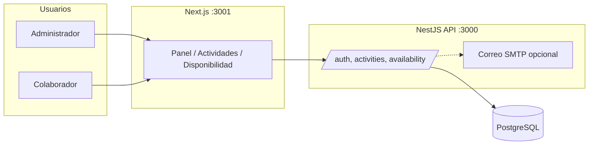

# SIGAC

Sistema integral de gestión de actividades colaborativas: **API NestJS** (`monolito/api-sigac`), **front Next.js** (`monolito/sigac`) y **PostgreSQL** (Prisma).

## Arquitectura (resumen)



- **Colaborador:** registra disponibilidad; ve actividades donde participa.
- **Administrador:** crea/edita/confirma/cancela actividades; ve resumen global; correo a participantes si SMTP está configurado.

## Requisitos

- Node.js LTS (20+)
- PostgreSQL 16+ (local o solo vía Docker)
- Docker Desktop (opcional, para levantar todo con Compose)

## Opción A — Sin Docker (desarrollo)

### 1. Base de datos

Crea una base `sigac` y un usuario con permisos.

### 2. API (`monolito/api-sigac`)

```bash
cd monolito/api-sigac
cp .env.example .env
# Edita .env: DATABASE_URL, JWT_SECRET, FRONTEND_ORIGIN=http://localhost:3001
npm install
npx prisma generate
npx prisma migrate deploy
npx prisma db seed
npm run start:dev
```

- API: http://localhost:3000  
- Swagger: http://localhost:3000/docs  
- Health: http://localhost:3000/health  

### 3. Front (`monolito/sigac`)

```bash
cd monolito/sigac
# Crea .env.local con:
# NEXT_PUBLIC_API_URL=http://localhost:3000
npm install
npm run dev
```

- App: http://localhost:3001  

### Usuario de prueba (tras el seed)

Ver credenciales en `monolito/api-sigac/prisma/seed.ts` (por defecto `admin@sigac.local` y contraseña indicada allí).

## Opción B — Docker (PostgreSQL + API + front)

Desde `monolito/`:

```bash
docker compose up --build
```

- Front: http://localhost:3001  
- API: http://localhost:3000 — **no hay página en `/`**; usa `/docs` o `/health`.  

**Primera vez:** crea el admin de prueba:

```bash
docker compose exec api npx prisma db seed
```

Opcional: define `JWT_SECRET` en un archivo `.env` en `monolito/` o en el entorno antes de `docker compose up`.

## Variables de entorno (API)

Copia `monolito/api-sigac/.env.example` a `.env` y completa:

| Variable | Descripción |
|----------|-------------|
| `DATABASE_URL` | Cadena PostgreSQL |
| `JWT_SECRET` | Secreto largo y aleatorio (nunca commitear el valor real) |
| `JWT_EXPIRES_IN` | Ej. `1h` |
| `FRONTEND_ORIGIN` | Origen del front (CORS), ej. `http://localhost:3001` |
| `MAIL_*` | Opcional; sin usuario/clave no se envían correos (solo logs) |

**No subas** `.env` al repositorio.

## Pruebas

```bash
# API: unitarias + e2e
cd monolito/api-sigac && npm run test:all

# Front (Vitest)
cd monolito/sigac && npm test
```

## Seguridad

- Rota cualquier secreto que haya podido filtrarse (repos públicos, capturas, `.env` compartidos).
- En producción: HTTPS, secretos solo en el orquestador o vault, y `FRONTEND_ORIGIN` acotado al dominio real.
